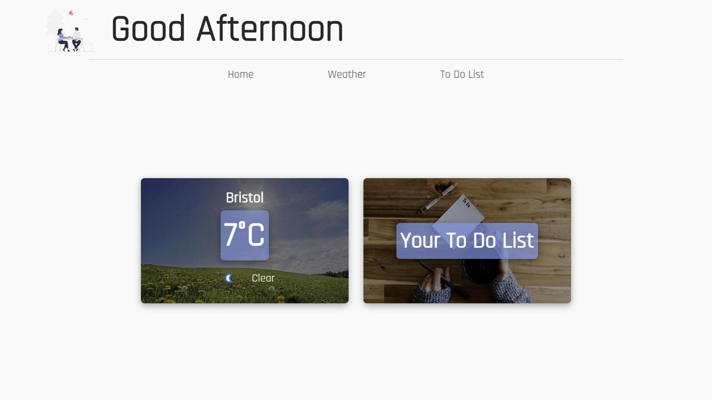
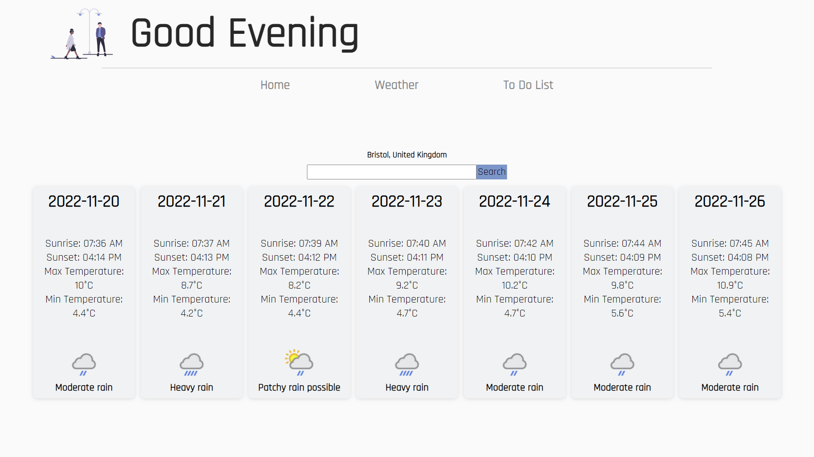
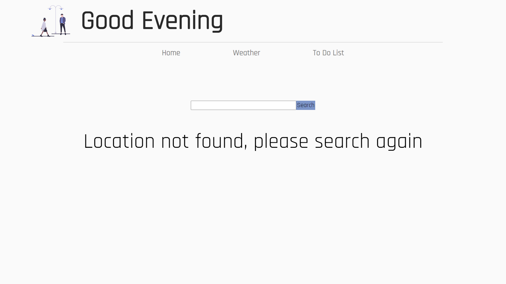
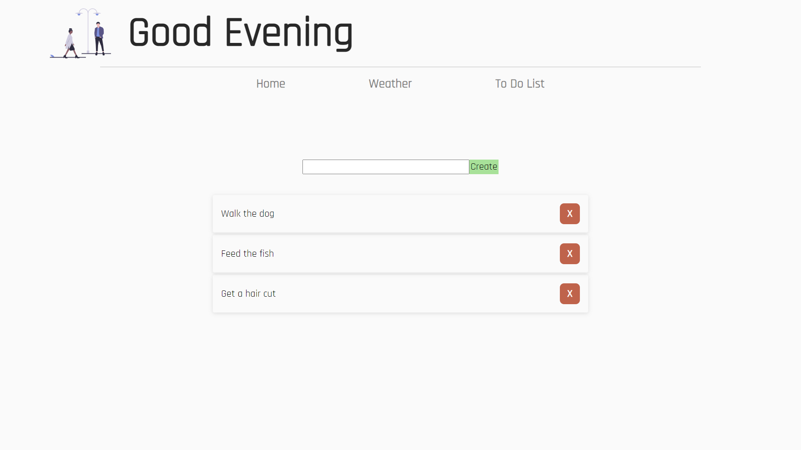

# Personal Application

My personal application currently contains a weather application and a to do list. I will be looking to add a traffic page and a local news page.
[Click here](https://andybowerman.github.io/personal-app/) to visit the live site.

## Design

### Home Page

The users home page displays a welcome message that updates depending on the time of day.
There is a weather card which displays the weather in the users current location.
There is also a link to their to do list where the user can create tasks for the day.

### Weather Page

The weather page automatically loads displaying the forecast for the next 7 days in the users current location.
There is also a search bar allowing the user to view the forecast in different locations. 

If the user enters a location that cannot be found an error message is displayed and they are prompted to search again. 

### To Do List

The user also has use of a bisc to do list where they can create and remove tasks for the day.

## Build

The site is built using React and Sass for styling.
The weather forecast is taken from the weather API [available here](https://www.weatherapi.com/).
